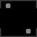

# Game

Game is a simple C++ game built using Raylib. It is a two-players game where the players controls a ball and has the objective to remove the other player from the field. 

## Table of Contents

1. [Installation](#installation)
2. [How to Play](#how-to-play)
3. [Contributing](#contributing)
4. [License](#license)

## Installation

To install the game, follow these steps:

Clone the repository to your local machine. 
Open the project in your preferred C++ IDE. 
Make sure you have the Raylib library installed on your machine. 
Build and run the game. 

## How to Play

Once you have installed the game, follow these steps to play: 

Use the arrow keys to move the player-2 up, down, left, or right. 
Use the WASD keys to move the player-1 up, down, left, or right. 
Use physics to your advantage. 
Take your opponent off the field to win. 

## Contributing

We welcome contributions to the game! If you would like to contribute, please follow these steps:

Fork the repository to your GitHub account. 
Create a new branch for your changes. 
Make your changes and commit them to the new branch. 
Push the new branch to your forked repository. 
Submit a pull request to the main repository. 

## License

The game is licensed under the [MIT License](https://github.com/FelipeFTN/Game/blob/master/LICENSE). Feel free to use and modify the game as you wish!
